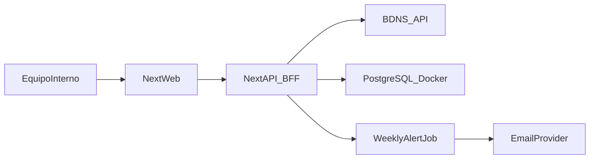

# Plan revisado: app interna de ayudas (sin usuarios) + aprendizaje guiado

## Enfoque de trabajo entre los dos

- Lo construiremos en modo **pair programming guiado**: tú implementas y yo te doy instrucciones, explicación del porqué y código completo en cada paso.
- No editaré código por mi cuenta salvo que me lo pidas explícitamente.
- No asumiré conocimientos previos sobre servicios externos (SMTP/Telegram): antes de cada integración se explicarán prerequisitos y configuración guiada paso a paso.
- Cada bloque incluirá:
  - objetivo,
  - concepto técnico que estás aprendiendo,
  - pasos concretos,
  - código completo para copiar/transcribir,
  - checklist de verificación.

## Objetivo del producto (fase interna)

Aplicación web interna para:

- Buscar convocatorias de ayudas/subvenciones a empresas.
- Filtrar y consultar detalle.
- Enviar alertas **programadas** (cron, p. ej. diarias) por email con novedades según múltiples perfiles.
- Enviar el mismo resumen **duplicado** por **email y Telegram** a destinatarios configurados en BD (o fallback env).

Fuente principal: BDNS ([https://www.pap.hacienda.gob.es/bdnstrans/GE/es/doc](https://www.pap.hacienda.gob.es/bdnstrans/GE/es/doc)).

## Arquitectura recomendada (simplificada)

- **Frontend + Backend web**: Next.js con TypeScript.
- **Persistencia**: PostgreSQL.
- **Procesos de alertas**: job programado vía `ALERTS_AUTORUN_CRON` (diario/semanal u otro).
- **Email**: proveedor transaccional (p. ej. Resend/SendGrid).
- **Contenerización**: Docker + Docker Compose desde el día 1.

## Estructura funcional (sin cuentas)

- Búsqueda y listado con filtros.
- Detalle de convocatoria.
- Configuración interna de alertas con múltiples perfiles y **lista editable de destinatarios** (varios correos y varios chat ID de Telegram), compartida para todos los envíos del resumen.
- Motor de alertas semanal que:
  - ejecuta búsqueda por perfil,
  - detecta novedades por perfil,
  - envía un resumen **por email y Telegram** a los destinatarios activos en base de datos (o, si una lista está vacía, a las variables de entorno de respaldo).

## Diferenciación frente al portal BDNS (valor añadido)

Para no replicar únicamente la consulta pública, se añade enfoque operativo interno:

- **Perfiles de alerta persistentes**:
  - múltiples perfiles de filtros de negocio (texto, CCAA, administración, fechas),
  - activables/desactivables según necesidad operativa.
- **Vigilancia automática de novedades**:
  - comparación contra snapshot histórico por perfil en cada corrida del job,
  - envío de solo convocatorias nuevas o relevantes (menos ruido).
- **Resumen accionable interno**:
  - email (y Telegram) con novedades por perfil; etiqueta de cadencia vía `ALERTS_DIGEST_PERIOD`.

## Modelo de datos ajustado (sin tabla de usuarios)

Tablas mínimas sugeridas (enfoque multi-alerta):

- `alert_profiles` (configuración de cada alerta: nombre, estado, filtros).
- `notification_recipients` (destinatarios por canal: `email` o `telegram`, varias filas, activar/pausar).
- `grants_snapshot` (convocatorias vistas por perfil para deduplicación).
- `alerts_history` (histórico de envíos por perfil y resultados incluidos).

## Bloques de implementación (orientados a aprendizaje)

### Bloque 1 - Base del proyecto y Docker

**Qué aprenderás**: por qué contenerizar desde el inicio y cómo separar servicios.

- Crear proyecto Next.js con TypeScript.
- Añadir `Dockerfile` para app y `docker-compose` con app + postgres.
- Levantar entorno local reproducible con un único comando.

### Bloque 2 - Integración BDNS (BFF)

**Qué aprenderás**: desacoplar API externa con una capa propia.

- Crear cliente BDNS en backend.
- Normalizar respuesta y gestionar errores/reintentos.
- Exponer endpoint interno `/api/grants/search`.

### Bloque 3 - Front de búsqueda y detalle

**Qué aprenderás**: flujo completo front-back y estado de filtros.

- UI de filtros globales + listado paginado.
- Página de detalle de convocatoria.
- Manejo de estados: loading, vacío, error.

### Bloque 4 - Configuración interna de alertas (multi-perfil)

**Qué aprenderás**: persistencia de configuración operativa.

- Pantalla/admin interna simple para:
  - crear/editar/desactivar perfiles de alerta,
  - definir filtros por perfil (texto, administración, CCAA, fechas),
  - **añadir, pausar o quitar destinatarios** de email y de Telegram (múltiples entradas por canal).
- Guardado en PostgreSQL de perfiles y de destinatarios; el **token del bot** y **SMTP** permanecen en variables de entorno (secretos).

### Bloque 5 - Motor semanal de alertas (multi-perfil)

**Qué aprenderás**: jobs periódicos e idempotencia.

- Job por cron que consulta BDNS para cada perfil activo.
- Detección de nuevas convocatorias respecto a `grants_snapshot` por perfil.
- Registro en `alerts_history` y envío **duplicado** por canales:
  - email resumen,
  - Telegram resumen.
- Subfase previa obligatoria de preparación de canales:
  - Crear bot de Telegram y obtener `TELEGRAM_BOT_TOKEN`.
  - Obtener al menos un `TELEGRAM_CHAT_ID` (o gestionar varios desde la web una vez creada la tabla `notification_recipients`).
  - Elegir proveedor SMTP (opción simple recomendada) y generar credenciales.
  - Configurar y validar variables en `docker-compose.yml`.
  - Probar cada canal por separado antes de la prueba integrada.
- El email prioriza valor operativo:
  - destacar nuevas convocatorias relevantes por perfil,
  - reducir ruido con deduplicación y resumen corto accionable.
- Telegram mantiene el mismo contenido operativo, adaptado al límite de longitud:
  - cabecera de ejecución + bloques por perfil,
  - partición automática en varios mensajes cuando sea necesario,
  - truncado controlado de títulos largos para legibilidad.

#### Bloque 5 - Checklist operativo de configuración (paso a paso)

1. **Telegram base**
  - Crear bot con BotFather.
  - Guardar token del bot en entorno seguro.
  - Definir chat destino (usuario o grupo) y recuperar chat ID.
  - Ejecutar prueba mínima de envío directo a la API de Telegram.
2. **SMTP base**
  - Elegir proveedor SMTP para entorno interno.
  - Generar usuario/clave SMTP (o API key SMTP).
  - Definir remitente válido (`SMTP_FROM`) según proveedor.
  - Probar conexión SMTP y envío de mensaje simple.
3. **Integración en entorno local**
  - Cargar variables de ambos canales en `docker-compose.yml`.
  - Reiniciar servicio `app`.
  - Ejecutar endpoint manual de alertas y verificar estado por canal:
    - `emailStatus`
    - `telegramStatus`
    - `dispatchStatus`
4. **Criterios de aceptación del bloque**
  - El sistema envía por email y Telegram en la misma ejecución.
  - Si un canal falla, el otro no se bloquea.
  - El histórico refleja estado final y mensaje de error por ejecución.

## Estado actual resumido

- Bloque 1: **Completado**.
- Bloque 2: **Completado**.
- Bloque 3: **Completado** (buscador con filtros, detalle en modal, persistencia de perfil base).
- Bloque 4: **Completado** (multi-alerta en modal + destinatarios multi-canal en BD/UI con fallback a env).
- Bloque 5: **Completado** (job con deduplicación y envío duplicado email + Telegram validado).
- Bloque 6: **En progreso** (lock de job, rate limit en POST manual, logs JSON, timeouts por canal; falta reintentos y caché opcional).
- Bloque 7: **Pendiente**.

### Bloque 6 - Hardening para uso interno

**Qué aprenderás**: calidad mínima operativa antes de escalar.

- **Hecho:** candado anti-ejecuciones simultáneas, rate limit del endpoint manual, logs estructurados (`weekly_run_*`), timeout por canal de envío.
- **Pendiente:** reintentos controlados por canal; caché de consultas BDNS frecuentes si hace falta.

### Bloque 7 - Preparación para futura venta (sin sobreingeniería)

**Qué aprenderás**: diseñar para evolución.

- Mantener separación clara entre UI, dominio e integración BDNS.
- Externalizar configuración por variables de entorno.
- Dejar base lista para introducir multi-tenant/usuarios más adelante sin rehacer todo.

## Organización de seguimiento para tu supervisor

En lugar de “entregables”, usaremos un estado por bloque:

- **Pendiente**
- **En progreso**
- **Completado**

Y en cada bloque reportarás:

- qué funcionalidad ya opera,
- qué riesgo técnico detectaste,
- siguiente paso inmediato.

## Riesgos principales y mitigación

- **Cambios/límites BDNS** -> encapsulación en BFF + caché + reintentos.
- **Ruido en alertas** -> filtros globales bien definidos + deduplicación por identificador/hash.
- **Migración a servidor** -> Docker Compose y variables de entorno desde inicio.

## Recomendaciones pedagógicas (como vamos a trabajar)

- Avanzar en iteraciones pequeñas (1 bloque cada vez).
- Antes de cada bloque: mini explicación conceptual (5-10 min).
- Después de cada bloque: prueba práctica contigo y resolución de dudas.
- Si una tecnología es nueva para ti, añadimos una “versión mínima funcional” antes de optimizar.

