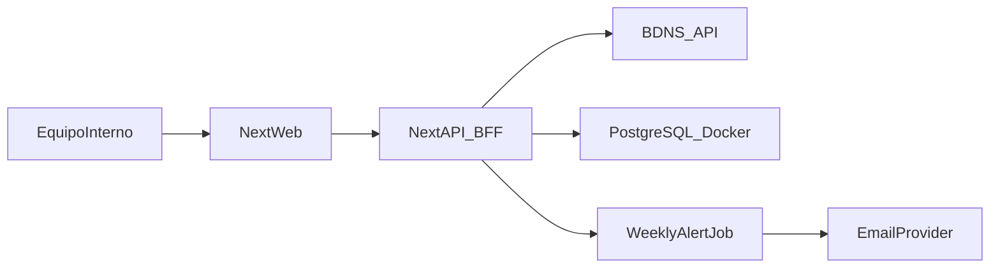

# Plan revisado: app interna de ayudas (sin usuarios) + aprendizaje guiado

## Enfoque de trabajo entre los dos

- Lo construiremos en modo **pair programming guiado**: tú implementas y yo te doy instrucciones, explicación del porqué y código completo en cada paso.
- No editaré código por mi cuenta salvo que me lo pidas explícitamente.
- Cada bloque incluirá:
  - objetivo,
  - concepto técnico que estás aprendiendo,
  - pasos concretos,
  - código completo para copiar/transcribir,
  - checklist de verificación.

## Objetivo del producto (fase interna)

Aplicación web interna para:

- Buscar convocatorias de ayudas/subvenciones a empresas.
- Filtrar y consultar detalle.
- Enviar alertas **semanales** por email con resultados nuevos según filtros globales.

Fuente principal: BDNS ([https://www.pap.hacienda.gob.es/bdnstrans/GE/es/doc](https://www.pap.hacienda.gob.es/bdnstrans/GE/es/doc)).

## Arquitectura recomendada (simplificada)

- **Frontend + Backend web**: Next.js con TypeScript.
- **Persistencia**: PostgreSQL.
- **Procesos de alertas**: job programado semanal.
- **Email**: proveedor transaccional (p. ej. Resend/SendGrid).
- **Contenerización**: Docker + Docker Compose desde el día 1.

## Estructura funcional (sin cuentas)

- Búsqueda y listado con filtros globales.
- Detalle de convocatoria.
- Configuración interna única (destinatarios fijos + filtros globales).
- Motor de alertas semanal que:
  - ejecuta búsqueda,
  - detecta novedades,
  - envía un email resumen a lista fija.

## Diferenciación frente al portal BDNS (valor añadido)

Para no replicar únicamente la consulta pública, se añade enfoque operativo interno:

- **Perfil global persistente de interés**:
  - un único perfil de filtros de negocio (texto, CCAA, administración, fechas),
  - editable en panel interno para toda la organización.
- **Vigilancia automática de novedades**:
  - comparación semanal contra snapshot histórico,
  - envío de solo convocatorias nuevas o relevantes (menos ruido).
- **Resumen accionable interno**:
  - email semanal con top resultados y enlaces directos al detalle interno.

## Modelo de datos ajustado (sin tabla de usuarios)

Tablas mínimas sugeridas:

- `global_filters` (configuración activa de filtros de alertas).
- `notification_recipients` (lista fija de emails internos).
- `grants_snapshot` (cache/normalización de convocatorias vistas).
- `alerts_history` (histórico de envíos y resultados incluidos).

## Bloques de implementación (orientados a aprendizaje)

### Bloque 1 - Base del proyecto y Docker

**Qué aprenderás**: por qué contenerizar desde el inicio y cómo separar servicios.

- Crear proyecto Next.js con TypeScript.
- Añadir `Dockerfile` para app y `docker-compose` con app + postgres.
- Levantar entorno local reproducible con un único comando.

### Bloque 2 - Integración BDNS (BFF)

**Qué aprenderás**: desacoplar API externa con una capa propia.

- Crear cliente BDNS en backend.
- Normalizar respuesta y gestionar errores/reintentos.
- Exponer endpoint interno `/api/grants/search`.

### Bloque 3 - Front de búsqueda y detalle

**Qué aprenderás**: flujo completo front-back y estado de filtros.

- UI de filtros globales + listado paginado.
- Página de detalle de convocatoria.
- Manejo de estados: loading, vacío, error.

### Bloque 4 - Configuración interna de alertas

**Qué aprenderás**: persistencia de configuración operativa.

- Pantalla/admin interna simple para:
  - editar filtros globales,
  - gestionar lista fija de destinatarios.
- Guardado en PostgreSQL.
- Incluir en la configuración global el **perfil persistente de interés**:
  - texto objetivo,
  - administración y CCAA,
  - rango temporal base.

### Bloque 5 - Motor semanal de alertas

**Qué aprenderás**: jobs periódicos e idempotencia.

- Job semanal (cron) que consulta BDNS con filtros globales.
- Detección de nuevas convocatorias respecto a `grants_snapshot`.
- Registro en `alerts_history` y envío de email resumen.
- El email prioriza valor operativo:
  - destacar nuevas convocatorias relevantes para el perfil global,
  - reducir ruido con deduplicación y resumen corto accionable.

### Bloque 6 - Hardening para uso interno

**Qué aprenderás**: calidad mínima operativa antes de escalar.

- Validación de entrada y rate limit básico.
- Logs estructurados y trazabilidad de jobs.
- Caché de consultas frecuentes para mejorar tiempos.

### Bloque 7 - Preparación para futura venta (sin sobreingeniería)

**Qué aprenderás**: diseñar para evolución.

- Mantener separación clara entre UI, dominio e integración BDNS.
- Externalizar configuración por variables de entorno.
- Dejar base lista para introducir multi-tenant/usuarios más adelante sin rehacer todo.

## Organización de seguimiento para tu supervisor

En lugar de “entregables”, usaremos un estado por bloque:

- **Pendiente**
- **En progreso**
- **Completado**

Y en cada bloque reportarás:

- qué funcionalidad ya opera,
- qué riesgo técnico detectaste,
- siguiente paso inmediato.

## Riesgos principales y mitigación

- **Cambios/límites BDNS** -> encapsulación en BFF + caché + reintentos.
- **Ruido en alertas** -> filtros globales bien definidos + deduplicación por identificador/hash.
- **Migración a servidor** -> Docker Compose y variables de entorno desde inicio.

## Recomendaciones pedagógicas (como vamos a trabajar)

- Avanzar en iteraciones pequeñas (1 bloque cada vez).
- Antes de cada bloque: mini explicación conceptual (5-10 min).
- Después de cada bloque: prueba práctica contigo y resolución de dudas.
- Si una tecnología es nueva para ti, añadimos una “versión mínima funcional” antes de optimizar.

