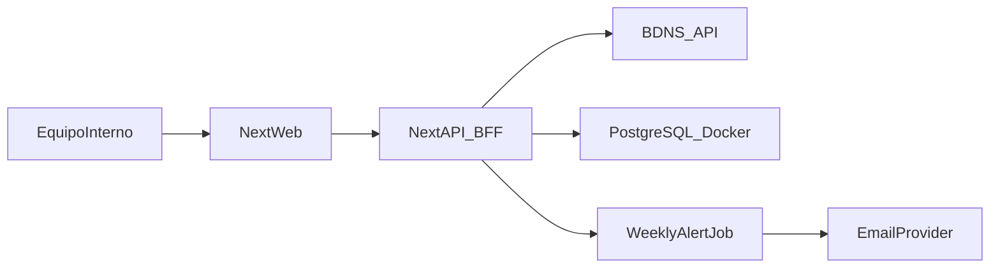

# Plan revisado: app interna de ayudas (sin usuarios) + aprendizaje guiado

## Enfoque de trabajo entre los dos

- Lo construiremos en modo **pair programming guiado**: tú implementas y yo te doy instrucciones, explicación del porqué y código completo en cada paso.
- No editaré código por mi cuenta salvo que me lo pidas explícitamente.
- No asumiré conocimientos previos sobre servicios externos (SMTP/Telegram): antes de cada integración se explicarán prerequisitos y configuración guiada paso a paso.
- Cada bloque incluirá:
  - objetivo,
  - concepto técnico que estás aprendiendo,
  - pasos concretos,
  - código completo para copiar/transcribir,
  - checklist de verificación.

## Objetivo del producto (fase interna)

Aplicación web interna para:

- Buscar convocatorias de ayudas/subvenciones a empresas.
- Filtrar y consultar detalle.
- Enviar alertas **programadas** (cron, p. ej. diarias) por email con novedades según múltiples perfiles.
- Enviar el mismo resumen **duplicado** por **email y Telegram** a destinatarios configurados en BD (o fallback env).

Fuente principal: BDNS ([https://www.pap.hacienda.gob.es/bdnstrans/GE/es/doc](https://www.pap.hacienda.gob.es/bdnstrans/GE/es/doc)).

## Arquitectura recomendada (simplificada)

- **Frontend + Backend web**: Next.js con TypeScript.
- **Persistencia**: PostgreSQL.
- **Procesos de alertas**: job programado vía `ALERTS_AUTORUN_CRON` (diario/semanal u otro).
- **Email**: proveedor transaccional (p. ej. Resend/SendGrid).
- **Contenerización**: Docker + Docker Compose desde el día 1.

## Estructura funcional (sin cuentas)

- Búsqueda y listado con filtros.
- Detalle de convocatoria.
- Configuración interna de alertas con múltiples perfiles y **lista editable de destinatarios** (varios correos y varios chat ID de Telegram), compartida para todos los envíos del resumen.
- Motor de alertas semanal que:
  - ejecuta búsqueda por perfil,
  - detecta novedades por perfil,
  - envía un resumen **por email y Telegram** a los destinatarios activos en base de datos (o, si una lista está vacía, a las variables de entorno de respaldo).

## Diferenciación frente al portal BDNS (valor añadido)

Para no replicar únicamente la consulta pública, se añade enfoque operativo interno:

- **Perfiles de alerta persistentes**:
  - múltiples perfiles de filtros de negocio (texto, CCAA, administración, fechas),
  - activables/desactivables según necesidad operativa.
- **Vigilancia automática de novedades**:
  - comparación contra snapshot histórico por perfil en cada corrida del job,
  - envío de solo convocatorias nuevas o relevantes (menos ruido).
- **Resumen accionable interno**:
  - email (y Telegram) con novedades por perfil; etiqueta de cadencia vía `ALERTS_DIGEST_PERIOD`.

## Modelo de datos ajustado (sin tabla de usuarios)

Tablas mínimas sugeridas (enfoque multi-alerta):

- `alert_profiles` (configuración de cada alerta: nombre, estado, filtros).
- `notification_recipients` (destinatarios por canal: `email` o `telegram`, varias filas, activar/pausar).
- `grants_snapshot` (convocatorias vistas por perfil para deduplicación).
- `alerts_history` (histórico de envíos por perfil y resultados incluidos).

## Bloques de implementación (orientados a aprendizaje)

### Bloque 1 - Base del proyecto y Docker

**Qué aprenderás**: por qué contenerizar desde el inicio y cómo separar servicios.

- Crear proyecto Next.js con TypeScript.
- Añadir `Dockerfile` para app y `docker-compose` con app + postgres.
- Levantar entorno local reproducible con un único comando.

### Bloque 2 - Integración BDNS (BFF)

**Qué aprenderás**: desacoplar API externa con una capa propia.

- Crear cliente BDNS en backend.
- Normalizar respuesta y gestionar errores/reintentos.
- Exponer endpoint interno `/api/grants/search`.

### Bloque 3 - Front de búsqueda y detalle

**Qué aprenderás**: flujo completo front-back y estado de filtros.

- UI de filtros globales + listado paginado.
- Página de detalle de convocatoria.
- Manejo de estados: loading, vacío, error.

### Bloque 4 - Configuración interna de alertas (multi-perfil)

**Qué aprenderás**: persistencia de configuración operativa.

- Pantalla/admin interna simple para:
  - crear/editar/desactivar perfiles de alerta,
  - definir filtros por perfil (texto, administración, CCAA, fechas),
  - **añadir, pausar o quitar destinatarios** de email y de Telegram (múltiples entradas por canal).
- Guardado en PostgreSQL de perfiles y de destinatarios; el **token del bot** y **SMTP** permanecen en variables de entorno (secretos).

### Bloque 5 - Motor semanal de alertas (multi-perfil)

**Qué aprenderás**: jobs periódicos e idempotencia.

- Job por cron que consulta BDNS para cada perfil activo.
- Detección de nuevas convocatorias respecto a `grants_snapshot` por perfil.
- Registro en `alerts_history` y envío **duplicado** por canales:
  - email resumen,
  - Telegram resumen.
- Subfase previa obligatoria de preparación de canales:
  - Crear bot de Telegram y obtener `TELEGRAM_BOT_TOKEN`.
  - Obtener al menos un `TELEGRAM_CHAT_ID` (o gestionar varios desde la web una vez creada la tabla `notification_recipients`).
  - Elegir proveedor SMTP (opción simple recomendada) y generar credenciales.
  - Configurar y validar variables en `docker-compose.yml`.
  - Probar cada canal por separado antes de la prueba integrada.
- El email prioriza valor operativo:
  - destacar nuevas convocatorias relevantes por perfil,
  - reducir ruido con deduplicación y resumen corto accionable.
- Telegram mantiene el mismo contenido operativo, adaptado al límite de longitud:
  - cabecera de ejecución + bloques por perfil,
  - partición automática en varios mensajes cuando sea necesario,
  - truncado controlado de títulos largos para legibilidad.

#### Bloque 5 - Checklist operativo de configuración (paso a paso)

1. **Telegram base**
  - Crear bot con BotFather.
  - Guardar token del bot en entorno seguro.
  - Definir chat destino (usuario o grupo) y recuperar chat ID.
  - Ejecutar prueba mínima de envío directo a la API de Telegram.
2. **SMTP base**
  - Elegir proveedor SMTP para entorno interno.
  - Generar usuario/clave SMTP (o API key SMTP).
  - Definir remitente válido (`SMTP_FROM`) según proveedor.
  - Probar conexión SMTP y envío de mensaje simple.
3. **Integración en entorno local**
  - Cargar variables de ambos canales en `docker-compose.yml`.
  - Reiniciar servicio `app`.
  - Ejecutar endpoint manual de alertas y verificar estado por canal:
    - `emailStatus`
    - `telegramStatus`
    - `dispatchStatus`
4. **Criterios de aceptación del bloque**
  - El sistema envía por email y Telegram en la misma ejecución.
  - Si un canal falla, el otro no se bloquea.
  - El histórico refleja estado final y mensaje de error por ejecución.

## Estado actual resumido

- Bloque 1: **Completado**.
- Bloque 2: **Completado**.
- Bloque 3: **Completado** (buscador con filtros, detalle en modal, persistencia de perfil base).
- Bloque 4: **Completado** (multi-alerta en modal + destinatarios multi-canal en BD/UI con fallback a env).
- Bloque 5: **Completado** (job con deduplicación y envío duplicado email + Telegram validado).
- Bloque 6: **Completado** (reintentos por canal con backoff, ampliación del timeout del runner; caché en memoria de búsquedas BDNS vía `BDNS_SEARCH_CACHE_TTL_SECONDS`).
- Bloque 7: **Completado** (capas y guía de evolución; ver `docs/evolucion-multi-tenant.md`).

---

- Bloque 8: **Completado** (tabla `company_profile`, API GET/PUT, sección en modal).
- Bloque 9: **Completado** (módulo `lib/ai/grant-analyzer.ts`, SDK OpenAI, endpoint de prueba `/api/ai/analyze-test`).
- Bloque 10: **Completado** (IA integrada en `weekly-runner.ts`: lee `company_profile`, llama a `analyzeGrants`, pasa `aiMap` a canales, persiste scoring en `alerts_history`).
- Bloque 11: **Completado** (email: sección "Recomendación IA" con tabla HTML ordenada por prioridad + links; Telegram: bloque compacto con emoji + links, bajas solo contadas; disclaimer en ambos).
- Bloque 12: **Pendiente** (enriquecimiento vía API BDNS: tipo beneficiario, sector, región, finalidad → enriquecer prompt IA; no requiere scraping).

### Bloque 6 - Hardening para uso interno

**Qué aprenderás**: calidad mínima operativa antes de escalar.

- **Hecho:** candado anti-ejecuciones simultáneas, rate limit del endpoint manual, logs estructurados (`weekly_run_*`), timeout por canal de envío, reintentos con backoff en SMTP y en cada envío a Telegram (`ALERTS_CHANNEL_RETRIES` / `ALERTS_CHANNEL_RETRY_DELAY_MS`), caché opcional de búsqueda BDNS en memoria (`BDNS_SEARCH_CACHE_TTL_SECONDS`).

### Bloque 7 - Preparación para futura venta (sin sobreingeniería)

**Qué aprenderás**: diseñar para evolución.

- **Hecho:** separación explícita `web/src/lib/domain` (tipos + `normalizeAlertFilters`), integración BDNS concentrada en `web/src/lib/bdns` (`urls`, `client`, `detail`, `regions`, caché), BFF en `route.ts`, guía `docs/evolucion-multi-tenant.md` en la raíz del repo.
- Configuración sensible sigue en variables de entorno; checklist de producto en la misma guía.

---

# Parte 2 — Análisis IA de convocatorias

## Objetivo

Pasar de **vigilancia** ("hay N convocatorias nuevas") a **recomendación** ("de esas N, estas 3 encajan con vuestra empresa porque…"). El análisis se ejecuta dentro del job existente (opción A: **antes** de enviar email/Telegram), de forma que el digest que llega ya incluye scoring y motivos.

## Requisitos previos

- Cuenta en **OpenAI** (o proveedor compatible) con API key.
- Definir un **perfil de empresa** (sector, tamaño, ubicación, intereses) para que la IA tenga contexto.

## Bloques de implementación (Parte 2)

### Bloque 8 - Perfil de empresa ✔

**Qué aprenderás**: persistir contexto de negocio que alimentará a la IA.

- **Hecho:** tabla `company_profile` (fila única id=1, `context_text` TEXT, `updated_at`), creada en `ensureTables` de `weekly-runner.ts` y en la propia route.
- API: `GET /api/settings/company-profile`, `PUT /api/settings/company-profile` (patrón fila única como `global-filters`).
- UI: sección "Perfil de empresa (contexto para IA)" al inicio del modal "Gestión de alertas" con textarea y botón guardar.
- Test actualizado: `documented-api-routes.test.ts` incluye la nueva ruta.
- Sin IA aún: solo persiste el contexto para usarlo en el bloque 9.

### Bloque 9 - Módulo de análisis IA (grant-analyzer) ✔

**Qué aprenderás**: integrar una API de LLM en tu backend.

- **Hecho:** módulo `web/src/lib/ai/grant-analyzer.ts` con SDK oficial `openai`.
- Función `analyzeGrants(companyContext, grants)` → `AnalyzeGrantsResult | null`.
  - **Input**: perfil de empresa (texto) + lista de `GrantItem`.
  - **Output**: por cada convocatoria → `relevance` (alta / media / baja) + `reason` (1 frase).
  - Devuelve `null` si falta API key o perfil (degradación limpia).
- Prompt de clasificación (no generación libre): respuesta JSON estricta, `temperature: 0.2`.
- Parser robusto: si la IA devuelve algo inesperado, se asigna `media` con aviso.
- Endpoint de prueba aislada: `POST /api/ai/analyze-test` (acepta body con convocatorias o usa snapshot).
- Variables: `OPENAI_API_KEY`, `AI_MODEL` (defecto `gpt-4o-mini`), `AI_MAX_GRANTS_PER_CALL` (defecto `30`).

### Bloque 10 - Integrar análisis IA en el job ✔

**Qué aprenderás**: componer un paso nuevo en un pipeline existente sin romperlo.

- **Hecho:** en `weekly-runner.ts`, tras detectar novedades y antes del envío:
  - Lee `company_profile` de BD.
  - Si hay `OPENAI_API_KEY` + perfil de empresa → `analyzeGrants` con todas las novedades.
  - Si no hay clave, perfil vacío, o la IA falla → el job sigue igual que antes (degradación limpia).
- `aiMap` (Map<grantId, GrantAiResult>) se pasa al payload de email y Telegram (preparado para Bloque 11).
- Tras envío, `alerts_history.payload_json` se actualiza con `aiRelevance` + `aiReason` por item.
- `WeeklyRunResult` incluye `aiAnalysis: { ran, model, tokensUsed, error }`.
- Logs: `weekly_run_ai_completed` / `weekly_run_ai_error`.

### Bloque 11 - Enriquecer email y Telegram con recomendación IA ✔

**Qué aprenderás**: presentar resultados de IA de forma útil al usuario final.

- **Hecho — Email** (`mailer.ts`): sección "🤖 Recomendación IA" al inicio con tabla HTML (badge color, motivo, link) ordenada por prioridad; versión texto plano equivalente.
- **Hecho — Telegram** (`telegram.ts`): bloque "🤖 RECOMENDACIÓN IA" como primer bloque, lista numerada con emoji, las de baja solo contadas, disclaimer.
- Si no hubo análisis IA la sección no aparece (compatible sin clave).
- Siempre se presenta como **sugerencia** ("verificar condiciones oficiales").

### Bloque 12 - Enriquecimiento de convocatorias vía API BDNS ⏳

**Qué aprenderás**: enriquecer datos en un pipeline antes de pasarlos a IA, y gestionar peticiones concurrentes a una API externa.

**Problema que resuelve**: actualmente la IA solo recibe título, organismo y fecha de cada convocatoria. No sabe si el beneficiario elegible es "personas jurídicas", "autónomos", "entidades locales", etc. Tampoco conoce el sector económico ni la región de impacto. Sin estos datos la IA puede recomendar ayudas para las que la empresa no es elegible.

**Descubrimiento clave**: la API BDNS (`/convocatorias?numConv=X&vpd=GE`) ya devuelve **todos** los campos necesarios en JSON. No hace falta scraping de HTML, lo que simplifica el bloque y lo hace más robusto.

| Campo API (`/convocatorias?numConv=X`) | Ejemplo | Uso en prompt IA |
|-----------------------------------------|---------|-----------------|
| `tiposBeneficiarios[].descripcion` | "PERSONAS JURÍDICAS QUE NO DESARROLLAN ACTIVIDAD ECONÓMICA" | Descartar si la empresa no encaja en la categoría |
| `sectores[].descripcion` + `codigo` | "INDUSTRIA MANUFACTURERA" (C) | Cruzar con el sector de la empresa |
| `regiones[].descripcion` | "ES42 - CASTILLA LA MANCHA" | Cruzar con la ubicación de la empresa |
| `descripcionFinalidad` | "Investigación, desarrollo e innovación" | Contexto adicional para la valoración |
| `instrumentos[].descripcion` | "SUBVENCIÓN Y ENTREGA DINERARIA…" | Tipo de ayuda |
| `presupuestoTotal` | 1300000 | Importe total de la convocatoria |

**Pasos técnicos**:

1. **Ampliar tipo `GrantItem`** (`lib/domain/grants.ts`): añadir campos opcionales `beneficiaryTypes`, `sectors`, `impactRegions`, `purpose`, `instrumentType`.
2. **Función de enriquecimiento** (`lib/bdns/detail.ts`):
   - `fetchGrantEligibility(grantId)` → campos de elegibilidad extraídos del JSON de la API BDNS.
   - Timeout + fallback a `null` por campo si la API no responde (no bloquear el pipeline).
3. **Orquestación en `weekly-runner.ts`**:
   - Tras detectar novedades y antes de llamar a la IA, enriquecer cada convocatoria nueva llamando a la API de detalle.
   - Concurrencia limitada (ej. 5 simultáneas) para no saturar la API BDNS.
   - Si una llamada falla, la convocatoria se envía a la IA sin datos de elegibilidad (degradación parcial).
4. **Actualizar prompt** (`grant-analyzer.ts`):
   - Incluir en `buildPrompt()` los nuevos campos: tipo de beneficiario, sector, región, finalidad.
   - La IA podrá decir "BAJA — beneficiario debe ser persona física, no encaja con empresa" o "ALTA — sector y región coinciden".
5. **Variable de entorno**: `AI_ENRICH_DETAIL` (boolean, defecto `true`) para poder desactivar el enriquecimiento.

**Riesgos y mitigación**:
- **Tasa de peticiones a BDNS**: concurrencia limitada + timeout individual por petición.
- **Latencia**: enriquecer 30 convocatorias en paralelo ~3-6 s; asumible dentro del timeout del job.
- **API caída o lenta**: degradación limpia; la IA sigue funcionando con los datos básicos que ya tenía.

## Modelo de datos adicional (Parte 2)

- `company_profile`: id (fila única), `context_text` (TEXT), `updated_at`.
- Ampliación de `alerts_history.payload_json`: cada item puede incluir `aiRelevance` y `aiReason` si se ejecutó análisis.

## Variables de entorno nuevas (Parte 2)

- `OPENAI_API_KEY` — clave de API de OpenAI (secreto, no en BD).
- `AI_MODEL` — modelo a usar (por defecto `gpt-4o-mini`).
- `AI_MAX_GRANTS_PER_CALL` — máximo de convocatorias a enviar por llamada (por defecto `30`).
- `AI_ENRICH_DETAIL` — activar enriquecimiento de convocatorias vía API BDNS antes del análisis IA (por defecto `true`).

## Riesgos y mitigación (Parte 2)

- **IA se equivoca** → presentar siempre como sugerencia, no como decisión definitiva.
- **Coste API** → `gpt-4o-mini` es barato (~fracciones de céntimo por corrida diaria); limitar con `AI_MAX_GRANTS_PER_CALL`.
- **Latencia** → una llamada 2-5 s; agrupar convocatorias en un solo prompt.
- **Fallo de OpenAI** → degradación limpia: el digest se envía sin sección IA.
- **Datos sensibles** → el perfil de empresa se envía a OpenAI; valorar si hay información confidencial.

---

## Organización de seguimiento para tu supervisor

En lugar de “entregables”, usaremos un estado por bloque:

- **Pendiente**
- **En progreso**
- **Completado**

Y en cada bloque reportarás:

- qué funcionalidad ya opera,
- qué riesgo técnico detectaste,
- siguiente paso inmediato.

## Riesgos principales y mitigación

- **Cambios/límites BDNS** -> encapsulación en BFF + caché + reintentos.
- **Ruido en alertas** -> filtros globales bien definidos + deduplicación por identificador/hash.
- **Migración a servidor** -> Docker Compose y variables de entorno desde inicio.

## Recomendaciones pedagógicas (como vamos a trabajar)

- Avanzar en iteraciones pequeñas (1 bloque cada vez).
- Antes de cada bloque: mini explicación conceptual (5-10 min).
- Después de cada bloque: prueba práctica contigo y resolución de dudas.
- Si una tecnología es nueva para ti, añadimos una “versión mínima funcional” antes de optimizar.

