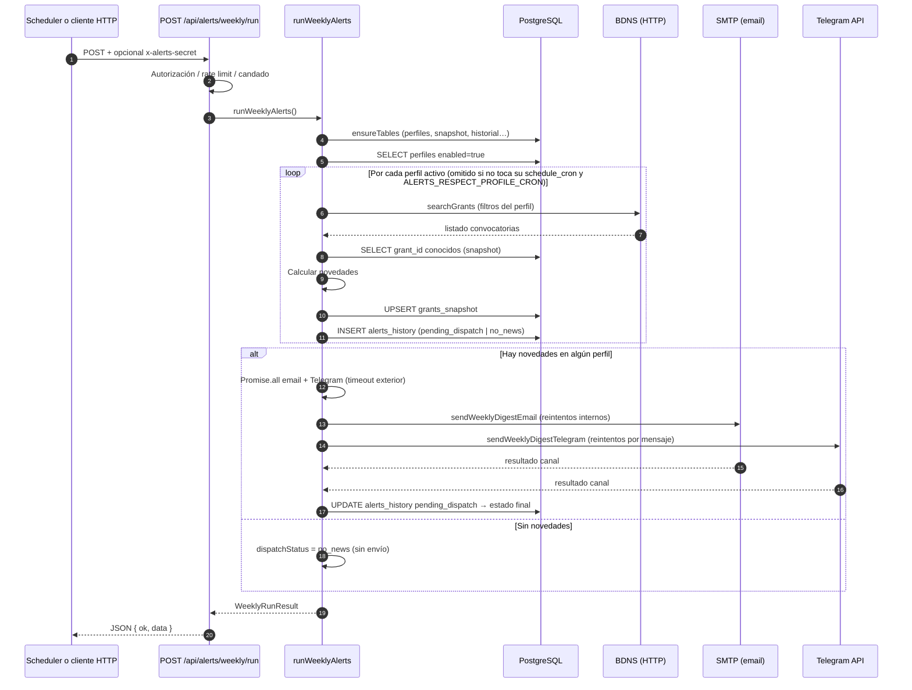

# Secuencia del job de alertas (resumen operativo)

Este diagrama describe el flujo lógico desde el **handler HTTP** hasta el núcleo del job: `web/src/app/api/alerts/weekly/run/route.ts` → **`runWeeklyAlerts`** en `web/src/lib/alerts/weekly-runner.ts`, alineado con `web/README.md`.

**Disparadores habituales:**

1. Contenedor **`scheduler`** (cron con `ALERTS_AUTORUN_CRON`) → `POST /api/alerts/weekly/run`.
2. Llamada manual (PowerShell, etc.) al mismo endpoint.

## Notas

- **Dos niveles de cron:** `ALERTS_AUTORUN_CRON` dispara el `POST`. Si `ALERTS_RESPECT_PROFILE_CRON=true`, dentro del job solo se procesan perfiles cuyo `schedule_cron` coincide con el minuto actual (`TZ`); ver `web/README.md`.
- **Caché BDNS:** si `BDNS_SEARCH_CACHE_TTL_SECONDS > 0`, las búsquedas repetidas con la misma URL pueden servirse desde memoria antes de llamar a BDNS.
- **Errores HTTP del POST:** 401 (secreto), 429 (rate limit), 409 (job ya en curso), 500 (error interno); logs `weekly_run_*` en consola del proceso Node.
